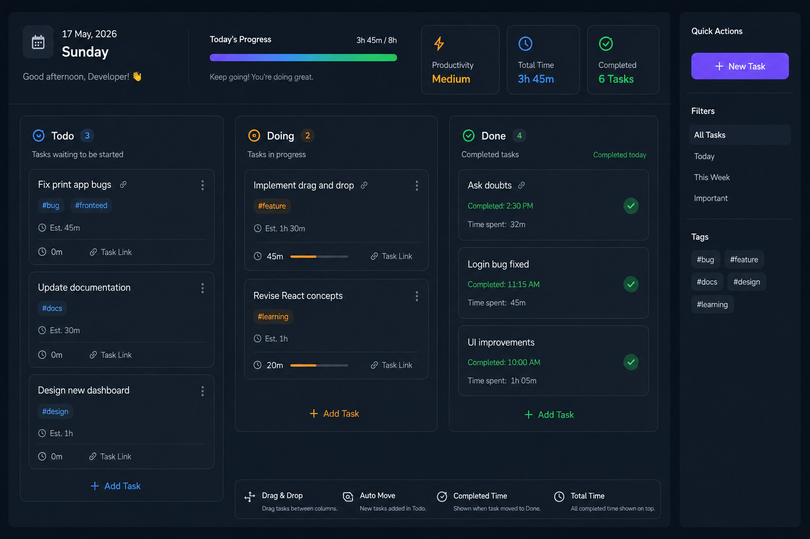
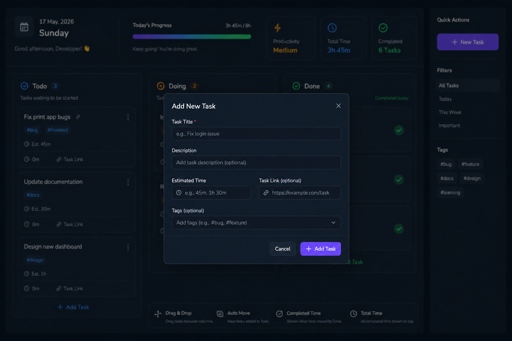
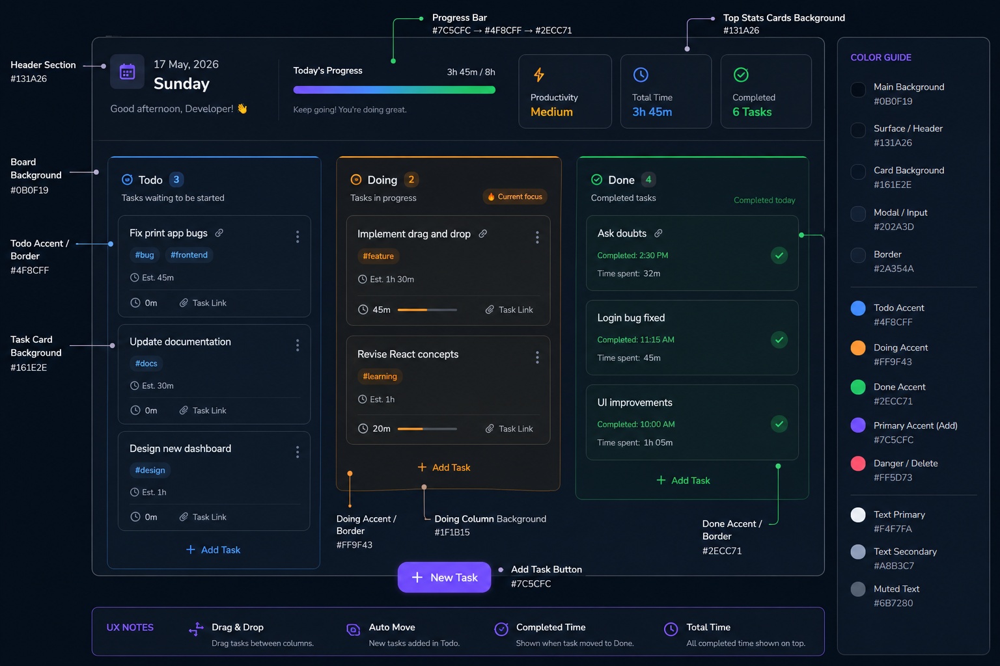

# Personal Task Manager App

## Final App

## Add Task Modal

## Color Hex Code Reference

# Productivity Board — Design System

## Theme Style
Minimal • Dark Workspace • Soft Glass • Focus-driven UI

---

# Core Colors

| Purpose | Hex | Notes |
|----------|------|-------|
| App Background | #0B0F19 | Main page background |
| Secondary Background | #131A26 | Panels and sections |
| Card Background | #1A2333 | Task cards |
| Modal Background | #202A3D | Add/Edit modal |
| Border | #2A354A | Subtle borders |
| Hover Background | #243047 | Card hover |
| Drag Background | #2A3955 | Active dragging state |

---

# Text Colors

| Purpose | Hex |
|----------|------|
| Primary Text | #F4F7FA |
| Secondary Text | #A8B3C7 |
| Muted Text | #6B7280 |
| Disabled | #4B5563 |

---

# Status Colors

| Section | Hex | Usage |
|-----------|------|------|
| Todo | #4F8CFF | Waiting tasks |
| Doing | #FF9F43 | Current work |
| Done | #2ECC71 | Completed |
| Delete | #FF5D73 | Remove actions |
| Add Button | #7C5CFC | CTA |
| Success | #22C55E | Notifications |
| Warning | #F59E0B | Alerts |
| Error | #EF4444 | Errors |

---

# Transparent Borders

| Purpose | Hex |
|----------|------|
| Todo Border | #4F8CFF40 |
| Doing Border | #FF9F4340 |
| Done Border | #2ECC7140 |

40 = transparency

---

# Gradients

## Productivity Progress

Start:
#7C5CFC

Middle:
#4F8CFF

End:
#2ECC71

Gradient:

linear-gradient(
90deg,
#7C5CFC,
#4F8CFF,
#2ECC71
)

---

# Layout Spacing

| Token | Value |
|---------|-------|
| xs | 4px |
| sm | 8px |
| md | 12px |
| lg | 16px |
| xl | 24px |
| xxl | 32px |
| section-gap | 48px |

---

# Border Radius

| Element | Radius |
|----------|--------|
| Small Button | 10px |
| Input | 12px |
| Cards | 20px |
| Panels | 24px |
| Modal | 28px |
| Floating Button | 999px |

---

# Shadows

Task Card:

box-shadow:
0px 4px 12px rgba(0,0,0,.15)

Hover:

box-shadow:
0px 10px 25px rgba(0,0,0,.30)

Dragging:

box-shadow:
0px 20px 40px rgba(0,0,0,.45)

---

# Typography

## Font

Inter

Fallback:

sans-serif

---

# Font Sizes

| Element | Size |
|----------|------|
| App Title | 32px |
| Section Title | 20px |
| Card Title | 16px |
| Body | 14px |
| Metadata | 12px |
| Tiny labels | 11px |

---

# Animation Timing

| Interaction | Duration |
|-------------|-----------|
| Hover | 200ms |
| Drag | 250ms |
| Modal Open | 300ms |
| Column Glow | 250ms |

Animation:

ease-in-out

---

# Column Styles

TODO

Accent:
#4F8CFF

Header icon:
📘

Purpose:
Tasks waiting

---

DOING

Accent:
#FF9F43

Header icon:
🔥

Purpose:
Current focus

Special:

Slightly larger than other columns

Background tint:

#1F1B15

---

DONE

Accent:
#2ECC71

Header icon:
✓

Purpose:
Completed work

---

# Drag State

Scale:

1.04

Rotation:

2deg

Opacity:

0.95

---

# Quick Actions

N → New Task

/ → Search

Ctrl + Enter → Add task

Double Click → Edit

Right Click → More actions

---

# Top Dashboard Cards

⚡ Productivity

⏱ Total Focus Time

✓ Completed Tasks

📈 Daily Progress

---

# Task Card Layout

Task Title

#tag #tag

Description

Started Time

Estimated Time

----------------

⏱ Duration

🔗 Link
